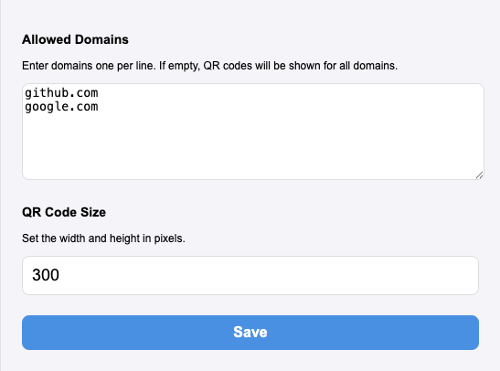

# Link to QR Code Hover Chrome Extension

This Chrome extension displays a QR code when you hover over a link on any webpage.

## Features

- Displays a QR code on link hover.
- Customizable list of allowed domains.
- Customizable QR code size.
- Toolbar icon for easy access to settings.

## How It Works

This extension injects a content script into web pages. When you hover over a hyperlink (`<a>` tag), it checks if the link's domain is in your allowed list (or if the list is empty, allowing all domains). If it matches, it generates a QR code for the link's URL and displays it near the cursor. The QR code disappears when you move the mouse away.

## Installation

1.  **Download the extension files:** Make sure you have all the files (`manifest.json`, `content.js`, `popup.html`, `popup.js`, the `lib` directory, and the `icons` directory) in a single folder.
2.  **Open Chrome Extensions:** Open Google Chrome and navigate to `chrome://extensions`.
3.  **Enable Developer Mode:** In the top-right corner of the Extensions page, toggle the "Developer mode" switch to the on position.
4.  **Load the extension:**
    *   Click the "Load unpacked" button that appears.
    *   In the file dialog, select the folder where you saved the extension files.
5.  **Done!** The extension should now be installed and active. You'll see its icon in the Chrome toolbar.

## Usage

1.  Click on the extension's icon in the Chrome toolbar to open the settings popup.
2.  In the text area, enter the domains you want to enable QR codes for, one domain per line (e.g., `google.com`). If you leave this empty, QR codes will be generated for all domains. 

 
3.  Set the desired size (width and height) of the QR code in pixels. The size must be between 50 and 500.
4.  Click "Save". The settings will apply immediately without needing to refresh the page.
5.  Navigate to any webpage.
6.  Hover your mouse cursor over any link (`<a>` tag) that belongs to an allowed domain.
7.  A small QR code will appear next to your cursor, encoding the URL of the link.
8.  Move your mouse away from the link, and the QR code will disappear.

## Development

### Building the Extension
1. Clone the repository
2. Make your changes
3. Load the unpacked extension in Chrome's developer mode

### Files
* content.js: Main content script that analyzes PRs and displays results
* manifest.json: Extension configuration
* popup.html: The popup html file
* popup.js: The popup javascript
* qrcode.min.js: Library that generate QR image from string

## License

This project is licensed under the [MIT License](https://github.com/mceSystems/QR-Code-On-Hover/blob/main/LICENSE).